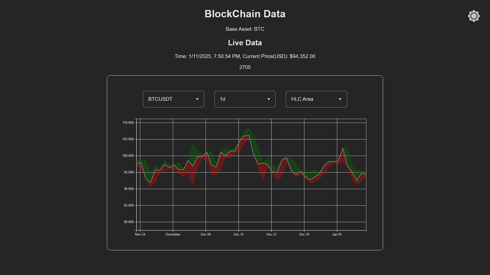
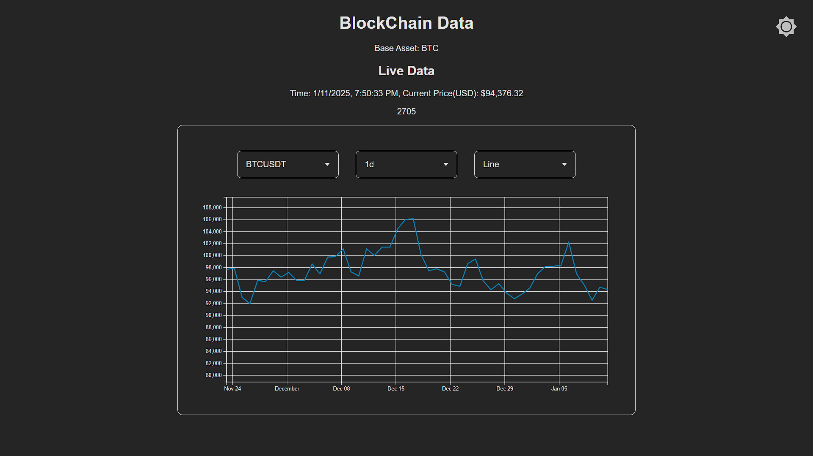
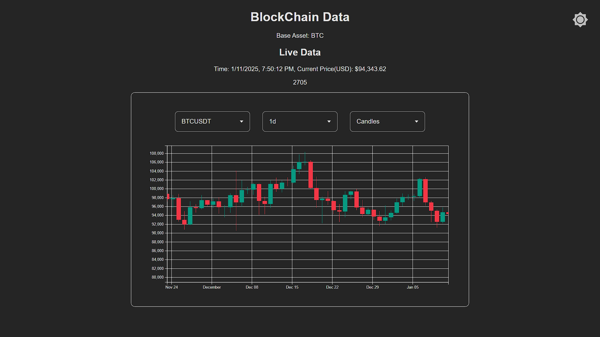
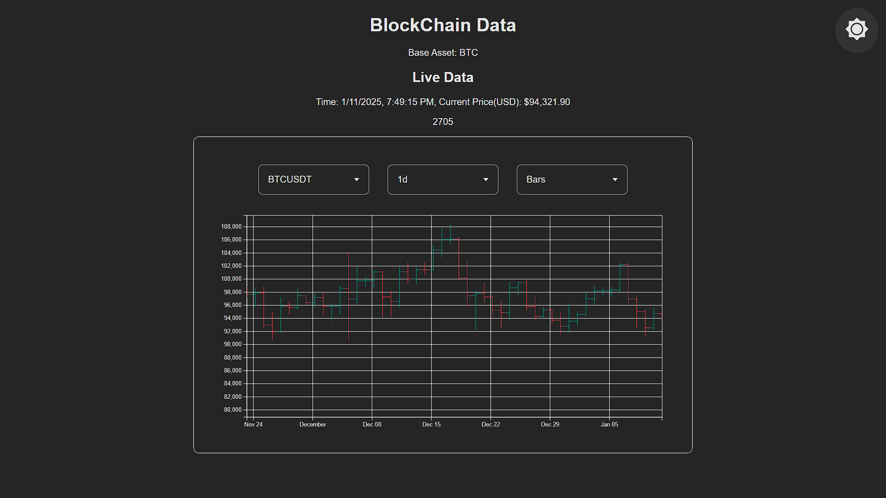
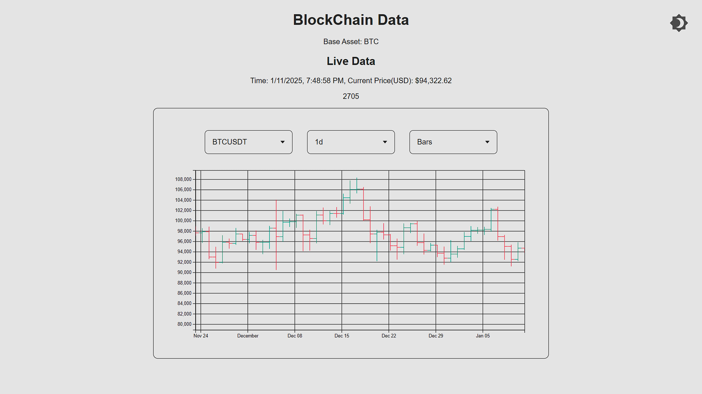

# Cryptocurrency-Price-Data
Cryptocurrency Price Data that fetches historical and live prices of selected cryptocurrencies from Binance API. It visualizes data with dynamic, interactive charts using D3.js, offering multiple chart options. Includes a theme toggle for light/dark mode, ensuring a seamless and customizable user experience.

## Features

- **Real-time Data**: Fetches live cryptocurrency prices from the Binance API.
- **Historical Data**: Retrieves historical price data for selected cryptocurrencies.
- **Interactive Charts**: Visualizes data using D3.js with various chart options, including:
  - Area Chart
  - Bar Chart
  - Candlestick Chart
  - Line Chart
- **Theme Toggle**: Switch between light and dark modes for personalized viewing.

